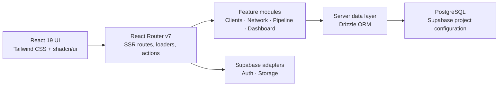

# SureCRM

### A referral-first CRM for independent insurance agents

SureCRM brings referral context, pipeline movement, and operating signals into
one workspace. The codebase centers each client record on two practical facts:
who introduced the client and where the opportunity currently sits.

**Public surface:** [surecrm-sigma.vercel.app](https://surecrm-sigma.vercel.app)

> **Portfolio scope:** this page describes repository evidence. It does not
> claim live customer adoption, verified authenticated flows, or operational
> reliability. The public URL was reachable on July 29, 2026; reachability alone
> does not verify the application behind authentication.

## The problem

Referral-led sales create context that a flat contact list can hide: who made
the introduction, how deep the relationship chain runs, and which opportunity
needs attention next. SureCRM is designed to keep that relationship context
beside the sales stage, so network analysis and day-to-day pipeline work use the
same client record.

## Core workflow

1. **Capture the client.** Store the client, the responsible agent, a current
   pipeline stage, and an optional referring client.
2. **Map the relationship.** Derive graph nodes, referral edges, chain depth,
   and referrer summaries from active client records.
3. **Progress the opportunity.** Work from a stage-based pipeline with client
   search, filtering, editing, stage movement, and exclusion flows represented
   in the route and feature modules.
4. **Review the book of business.** Bring client, pipeline, referral, goal, and
   recent-activity queries into a dashboard view.

## What makes it different

Referral context is part of the CRM data model rather than a separate note. The
same client profile supports three connected views:

| Shared field or scope    | Product view     | Repository behavior                                                   |
| ------------------------ | ---------------- | --------------------------------------------------------------------- |
| `referredById`           | Referral network | Builds client-to-client edges, referral depth, and referrer summaries |
| `currentStageId`         | Sales pipeline   | Places active clients in agent-defined stages                         |
| Agent-scoped client data | Dashboard        | Aggregates clients, referrals, stages, recent clients, and goals      |

## Synthetic product previews

All media below is **synthetic portfolio artwork**. Names, values, accounts, and
relationships are fictional; these images are not captures of a live tenant and
do not prove runtime behavior.

### Referral network

See who introduced whom and how referral chains connect across a book of
business.


_Synthetic preview — illustrative data only._

### Sales pipeline

Keep relationship context visible while opportunities move through
agent-defined stages.


_Synthetic preview — illustrative data only._

### Dashboard

Review client, referral, pipeline, and goal summaries from a single operating
view.


_Synthetic preview — illustrative data only._

## Architecture



- Routes are registered in [`app/routes.ts`](app/routes.ts), with product code
  organized by feature.
- PostgreSQL schemas are defined with Drizzle, including agent/team ownership,
  pipeline stages, clients, and the self-referencing referral field.
- Supabase database, authentication, and storage clients are present in the
  repository. Their live configuration and behavior are environment-dependent.
- Korean, English, and Japanese resource trees are present, with Korean
  configured as the fallback language.
- The React Router configuration uses the Vercel preset. This records a
  deployment target, not a verified deployment.

## Verification status

`Source-inspected` means the relevant route, schema, and implementation were
reviewed in this repository. It does not mean the behavior passed a browser,
database, provider, security, or end-to-end test.

| Area                                 | Evidence                                                                                                                                                         | Status and boundary                                                                                             |
| ------------------------------------ | ---------------------------------------------------------------------------------------------------------------------------------------------------------------- | --------------------------------------------------------------------------------------------------------------- |
| Product positioning                  | Landing metadata and feature copy describe a CRM for insurance agents centered on referral-network management                                                    | **Source-inspected**                                                                                            |
| Referral data model                  | [`app/lib/schema/core.ts`](app/lib/schema/core.ts) defines `referredById`; [`network-data.ts`](app/features/network/lib/network-data.ts) derives nodes and edges | **Source-inspected**; live data not tested                                                                      |
| Pipeline workflow                    | `/pipeline` route, pipeline page, stage queries, and responsive board components are present                                                                     | **Source-inspected**; browser interactions not tested                                                           |
| Dashboard workflow                   | Dashboard loader/data modules query client, referral, stage, goal, and recent-client data                                                                        | **Source-inspected**; live aggregates not tested                                                                |
| Authentication and account isolation | Auth middleware and protected route calls are present                                                                                                            | **Not end-to-end verified**; no secure-multitenancy claim                                                       |
| Provider integrations and webhooks   | Supabase, calendar, billing, email, analytics, and monitoring modules or dependencies are present                                                                | **Not operationally verified**; no webhook-reliability claim                                                    |
| Deployment                           | Vercel preset and build configuration are present; the public URL returned HTTP 200 on July 29, 2026                                                             | **Reachability only**; authenticated behavior and uptime not verified                                           |
| Portfolio media                      | Three SVGs under `docs/assets/portfolio/` passed XML, local render, accessibility-metadata, and active-content scans                                             | **Synthetic**; not customer or adoption evidence                                                                |
| This portfolio change                | `npm ci`, targeted formatting, a provider-isolated CI build, artifact secret scan, and `git diff --check`                                                        | **Passed locally**                                                                                              |
| Repository quality baseline          | Full `format:check`, `lint`, `typecheck`, and `test:run` scripts                                                                                                 | **Pre-existing failures**: 41 files; 249 errors and 2,816 warnings; 54 TypeScript errors; 4 of 143 tests failed |

## Local development

This repository uses npm and requires environment-backed services.

```bash
npm ci
npm run dev
```

Before starting, create a local `.env` that is excluded from version control.
The core paths reference at least:

```dotenv
DATABASE_URL=
SESSION_SECRET=
NODE_ENV=development

SUPABASE_URL=
SUPABASE_ANON_KEY=
SUPABASE_SERVICE_ROLE_KEY=
VITE_SUPABASE_URL=
VITE_SUPABASE_ANON_KEY=
```

Keep the service-role key server-only. Calendar, billing, email, analytics,
monitoring, and bot-protection paths require additional provider-specific
variables when those paths are exercised. The current `.env.example` is not a
complete application environment manifest; inspect the relevant module and
[`scripts/test-env-setup.ts`](scripts/test-env-setup.ts) before enabling an
integration.

The development server prints its local URL and runs with React Router's
development server and HMR.

## Quality checks

The repository exposes these application-level checks:

```bash
npm run format:check
npm run lint
npm run typecheck
npm run test:run
npm run build
```

Local validation for this change passed dependency installation, targeted
formatting for supported changed files, a provider-isolated build, SVG render
and safety checks, the artifact secret scan, and `git diff --check`. The full
repository checks also surfaced existing baseline debt: 41 files fail the
format check, lint reports 249 errors and 2,816 warnings, typecheck reports 54
errors, and four `useViewport` tests fail while 139 tests pass.

## Deployment boundary

The repository targets Vercel through `@vercel/react-router` and a checked-in
build configuration. The public URL returned HTTP 200 during this portfolio
review, but authenticated product journeys, provider integrations, and uptime
were not inspected. A build artifact, deployment configuration, reachable URL,
and verified application are separate evidence states.

## Known limits

- The preview media is synthetic and contains no real customer or tenant data.
- Auth routes and middleware exist, but authenticated journeys, authorization
  isolation, and team/tenant boundaries have not been independently verified
  end to end.
- No claim is made for production readiness, enterprise readiness, encryption
  level, secure multitenancy, PIPA/GDPR compliance, live adoption, uptime, or
  webhook reliability.
- External services require credentials and provider-side configuration that
  are not validated by repository inspection.
- The current environment example is incomplete for running the application.
- Full repository formatting, lint, typecheck, and tests are not green at this
  baseline; the exact local counts are recorded above.
- Browser flows, live provider calls, and deployment behavior remain
  unverified.

## License

Licensed under the [MIT License](LICENSE).
