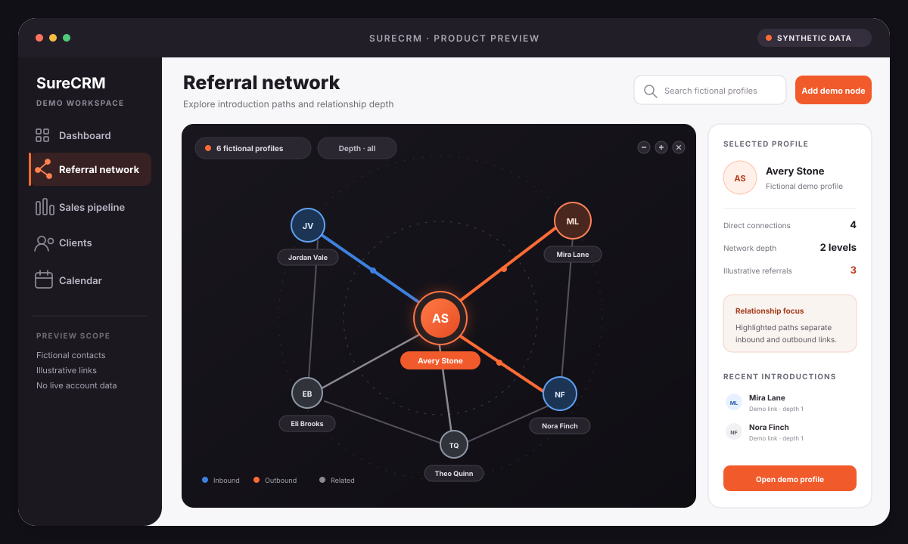
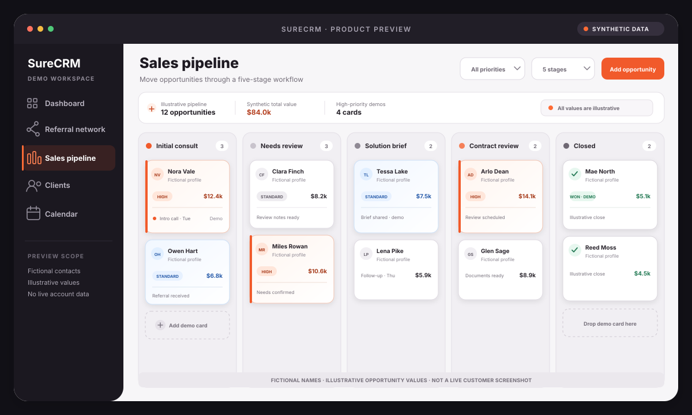
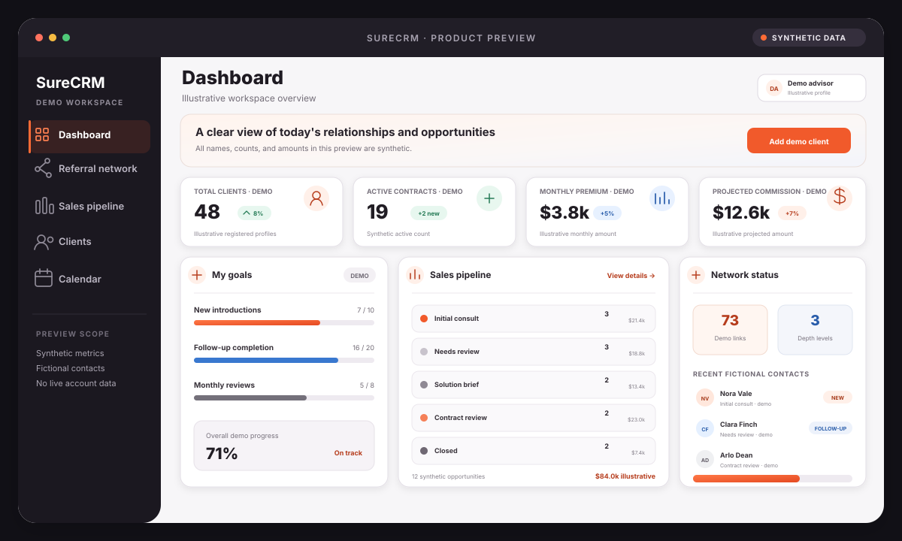
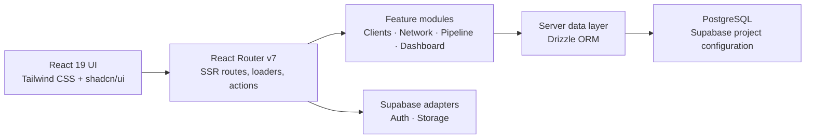

# SureCRM

### An archived CRM prototype built from one insurance agent's workflow

SureCRM began with conversations with an insurance-agent friend about
managing referral relationships, sales stages, and follow-ups in one place. I
was the sole human product owner, designer, and builder, and I used AI
extensively throughout development.

One practitioner—the friend who informed the original requirements—logged in,
tested the product, and gave qualitative feedback. The project did not progress to sustained operational use.

> **Status:** Archived portfolio project · Solo human build · Heavily
> AI-assisted · Practitioner test (n=1)

## Origin and scope

The first brief came from one person, not a market study. My friend described
three needs from insurance sales work:

1. see who introduced each prospective client;
2. connect follow-up work with Google Calendar;
3. manage the sales process on a Kanban board.

I treated those conversations as a concrete product brief. They informed the
prototype, but they do not establish that the same needs, priorities, or
workflow apply across the insurance industry.

## My role and AI assistance

I owned product framing, interaction design, implementation, integration, and
deployment as the only human builder. The practitioner supplied the initial
requirements and later tested the result; he did not co-build the product.

I used AI coding tools extensively. I remained responsible for choosing the
scope, translating the workflow into a data model, combining the generated
work, and deciding what to ship. “Solo build” describes human ownership, not hand-written code.

The historical project post described that dependence openly. This case study
keeps the same disclosure because the useful evidence is not unaided coding; it
is the ability to frame a real problem, direct an AI-assisted build, inspect the
result, and remain accountable for the claims attached to it.

## The product thesis

The central product decision was to keep referral context beside the sales
stage on each client record. A flat contact list can show who a client is; this
model also records who introduced that client and where the opportunity sits.
That choice connected network exploration and day-to-day pipeline work through
the same record instead of treating the referral graph as a separate
visualization.

| Shared field or scope    | Product view     | Repository behavior                                                   |
| ------------------------ | ---------------- | --------------------------------------------------------------------- |
| `referredById`           | Referral network | Builds client-to-client edges, referral depth, and referrer summaries |
| `currentStageId`         | Sales pipeline   | Places active clients in agent-defined stages                         |
| Agent-scoped client data | Dashboard        | Aggregates clients, referrals, stages, recent clients, and goals      |

## What I built

1. **Client records.** Store a client, responsible agent, pipeline stage, and
   optional referring client.
2. **Referral network.** Derive graph nodes, referral edges, chain depth, and
   referrer summaries from client records.
3. **Sales pipeline.** Search, filter, edit, and move opportunities through
   agent-defined stages.
4. **Dashboard.** Combine client, pipeline, referral, goal, and recent-activity
   queries into one operating view.

These workflows are present in the repository. Their presence proves
implementation, not repeated practitioner use.

Google Calendar was part of the original brief and integration code exists,
but this case study focuses on the referral, pipeline, and dashboard paths that
are easiest to trace directly. Provider integration code does not prove that a
live provider-backed flow remains operational.

## Practitioner test

The practitioner who informed the brief logged in, tested the prototype, and
gave qualitative feedback. The project stopped at that level of validation.
There is no approved testimonial, measured productivity outcome, retention
record, or evidence of repeated operational use.

## Why I archived it

After deployment and initial testing, the product did not become part of a
repeated working routine. Continued operation was not justified by the evidence
for repeat need, business value, or maintenance value, and my priorities moved
elsewhere.

I keep the repository as a case study of the product decisions, data model, and
implementation—not as an active-service or adoption claim.

## Product previews

All media below is **synthetic portfolio artwork**. Names, values, accounts,
and relationships are fictional. These images are not captures of a live
tenant and do not prove runtime behavior.

### Referral network



_Synthetic preview — illustrative data only._

### Sales pipeline



_Synthetic preview — illustrative data only._

### Dashboard



_Synthetic preview — illustrative data only._

## Architecture



- Routes are registered in [`app/routes.ts`](app/routes.ts), with product code
  organized by feature.
- PostgreSQL schemas are defined with Drizzle, including agent/team ownership,
  pipeline stages, clients, and the self-referencing referral field.
- Supabase database, authentication, and storage adapters are present. Their
  live configuration and behavior are environment-dependent.
- Korean, English, and Japanese resource trees are present, with Korean
  configured as the fallback language.

## Evidence and limits

`Source-inspected` means that the relevant route, schema, and implementation
were reviewed in this repository. It does not mean that the behavior passed a
browser, database, provider, security, or end-to-end test.

| Area                   | Evidence                                          | Boundary                                               |
| ---------------------- | ------------------------------------------------- | ------------------------------------------------------ |
| Origin and role        | Noah's account and the historical project post    | One practitioner; heavily AI-assisted solo human build |
| Referral model         | `referredById` schema and network derivation code | **Source-inspected**; live data not tested             |
| Pipeline and dashboard | Routes, feature modules, and data queries         | **Source-inspected**; browser behavior not tested      |
| Practitioner test      | One login-based test and qualitative feedback     | Test n=1; no sustained use or quantitative outcome     |
| Deployment             | A historical deployment existed                   | No active-service, uptime, security, or adoption claim |
| Portfolio previews     | Three SVG files with fictional data               | Synthetic illustration; not runtime evidence           |

The project is archived and unsupported. Authenticated journeys, authorization
isolation, provider integrations, privacy-law compliance, and operational
reliability have not been independently verified. Do not enter real personal,
insurance, payment, or credential data into any historical deployment.

See
[`docs/portfolio/verification-2026-07-30.md`](docs/portfolio/verification-2026-07-30.md)
for the dated source and quality review.

## Local development

This repository uses npm and environment-backed services.

```bash
npm ci
npm run dev
```

Create a local `.env` that remains excluded from version control. The
application references database, session, Supabase, calendar, billing, email,
analytics, monitoring, and bot-protection configuration. The checked-in
`.env.example` is not a guarantee that every historical integration is
operational.

Available checks include:

```bash
npm run format:check
npm run lint
npm run typecheck
npm run test:run
npm run build
```

The repository did not have a green full-quality baseline at the dated
portfolio review. Consult the verification note before interpreting a newer
result.

## License

Licensed under the [MIT License](LICENSE).
