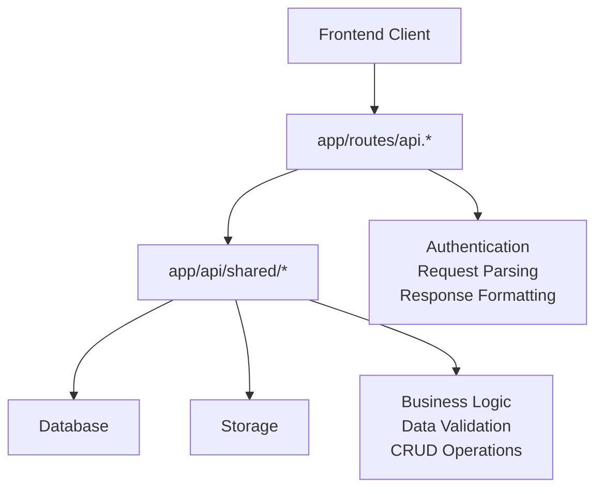

# 🏗️ SureCRM API 아키텍처 문서

## 📁 폴더 구조 설명

SureCRM의 API는 **계층 분리 아키텍처**를 사용하여 유지보수성과 재사용성을 극대화했습니다.

### `app/api/` - 비즈니스 로직 계층

```
app/api/
├── shared/
│   ├── auth.ts              # 인증 및 권한 관리
│   ├── clients.ts           # 고객 관리 비즈니스 로직
│   ├── insurance-contracts.ts # 보험계약 관리 비즈니스 로직
│   ├── client-extended-data.ts # 고객 확장 데이터 관리
│   ├── opportunity-products.ts # 영업 기회 상품 관리
│   ├── types.ts             # 공통 타입 정의
│   └── utils.ts             # 공통 유틸리티 함수
```

**역할:**

- ✅ 순수한 비즈니스 로직 함수들
- ✅ 데이터베이스 CRUD 작업
- ✅ 데이터 검증 및 변환
- ✅ 에러 처리 및 로깅
- ✅ 재사용 가능한 함수들

**특징:**

- HTTP 요청과 무관한 순수 함수
- React Router와 독립적
- 테스트하기 쉬운 구조
- 다른 프로젝트에서도 재사용 가능

### `app/routes/api.*` - HTTP 엔드포인트 계층

```
app/routes/
├── api.auth.check-email.ts     # 이메일 중복 확인
├── api.auth.me.ts              # 현재 사용자 정보
├── api.auth.resend-verification.ts # 인증 재전송
├── api.auth.validate-invitation.ts # 초대장 검증
├── api.clients.*.ts            # 고객 관련 엔드포인트
├── api.insurance-contracts.ts  # 보험계약 엔드포인트
├── api.notifications.ts        # 알림 엔드포인트
└── ...
```

**역할:**

- ✅ HTTP 요청/응답 처리
- ✅ 라우팅 및 매개변수 추출
- ✅ 인증 미들웨어 적용
- ✅ 요청 데이터 파싱 (JSON, FormData)
- ✅ 응답 포맷팅
- ✅ HTTP 상태 코드 설정

**특징:**

- React Router v7 파일 기반 라우팅
- 얇은 래퍼 역할 (thin controller)
- `app/api/shared/` 함수들을 호출
- HTTP 프로토콜 특화 처리

## 🔄 데이터 흐름



### 실제 예시: 보험계약 삭제

1. **Frontend** → `DELETE /api/insurance-contracts`
2. **Route Handler** (`app/routes/api.insurance-contracts.ts`)
   - 인증 확인
   - FormData 파싱
   - `actionType` 확인
3. **Business Logic** (`app/api/shared/insurance-contracts.ts`)
   - `deleteInsuranceContract()` 함수 호출
   - 트랜잭션으로 DB 레코드 삭제
   - Storage 파일 삭제
4. **Response** → JSON 형태로 결과 반환

## 🎯 설계 원칙

### 1. 관심사 분리 (Separation of Concerns)

- **라우트**: HTTP 처리에만 집중
- **비즈니스 로직**: 데이터 처리에만 집중

### 2. 재사용성 (Reusability)

- `app/api/shared/` 함수들은 여러 라우트에서 공유
- 다른 프로젝트로 이식 가능

### 3. 테스트 가능성 (Testability)

- 비즈니스 로직은 HTTP와 독립적
- 단위 테스트 작성 용이

### 4. 확장성 (Scalability)

- 새로운 엔드포인트 추가 시 기존 로직 재사용
- 마이크로서비스로 분리 시 용이

## 🚀 장점

### 기존 방식 (단순 라우트) vs 현재 방식 (계층 분리)

| 기존 방식               | 현재 방식        |
| ----------------------- | ---------------- |
| 라우트에 모든 로직 집중 | 계층별 역할 분리 |
| 코드 중복 발생          | 로직 재사용      |
| 테스트 어려움           | 테스트 용이      |
| 유지보수 복잡           | 유지보수 간편    |

## 📋 개발 가이드라인

### 새로운 API 추가 시

1. **비즈니스 로직** 먼저 구현

   ```typescript
   // app/api/shared/새기능.ts
   export async function create새기능(data: any) {
     // 순수한 비즈니스 로직
   }
   ```

2. **라우트 핸들러** 추가
   ```typescript
   // app/routes/api.새기능.ts
   export async function action({ request }) {
     const user = await requireAuth(request);
     const data = await parseFormData(request);
     const result = await create새기능(data);
     return Response.json(result);
   }
   ```

### 수정 시 주의사항

- ✅ **DO**: `app/api/shared/`의 함수 수정
- ❌ **DON'T**: 라우트 파일에 비즈니스 로직 추가
- ✅ **DO**: 에러 처리는 비즈니스 로직에서
- ❌ **DON'T**: HTTP 관련 코드는 비즈니스 로직에 포함 금지

## 🎉 결론

현재의 아키텍처는 **중복이 아닌 최적화된 설계**입니다:

- **확장성**: 새 기능 추가 용이
- **유지보수성**: 코드 수정 시 영향 범위 최소화
- **재사용성**: 비즈니스 로직 재활용
- **테스트 가능성**: 계층별 독립 테스트

이 구조를 유지하면서 지속적으로 개발하시면 됩니다! 🚀
