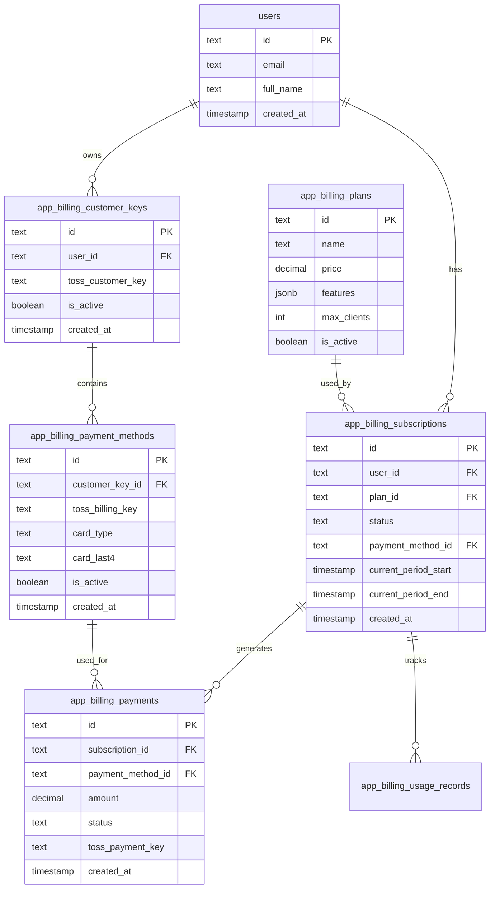

# 🗄️ SureCRM 구독 결제 - 데이터베이스 스키마 설계

## 📚 목차

1. [스키마 개요](#1-스키마-개요)
2. [핵심 테이블 설계](#2-핵심-테이블-설계)
3. [관계 및 제약조건](#3-관계-및-제약조건)
4. [인덱스 전략](#4-인덱스-전략)
5. [마이그레이션 계획](#5-마이그레이션-계획)
6. [성능 최적화](#6-성능-최적화)

---

## 🎯 **1. 스키마 개요**

### **1.1 설계 원칙**

- **기존 네이밍 컨벤션 준수**: `app_billing_*` 패턴 사용
- **확장성 고려**: 향후 멀티 플랜, 할인, 쿠폰 등 대비
- **데이터 일관성**: 강력한 제약조건으로 데이터 무결성 보장
- **감사 추적**: 모든 중요 변경사항 로깅
- **성능 최적화**: 적절한 인덱스와 파티셔닝

### **1.2 테이블 구조 개요**



---

## 🏗️ **2. 핵심 테이블 설계**

### **2.1 구독 플랜 테이블**

```sql
-- app/lib/schema/billing.ts
export const billingPlans = pgTable('app_billing_plans', {
  id: text('id').primaryKey(),
  name: text('name').notNull(),
  description: text('description'),

  -- 가격 정보
  price: decimal('price', { precision: 10, scale: 2 }).notNull(),
  currency: text('currency').default('KRW').notNull(),
  billing_interval: text('billing_interval').default('month').notNull(), // month, year

  -- 기능 및 제한사항
  features: json('features').$type<string[]>(),
  max_clients: integer('max_clients').default(-1), // -1 = 무제한
  max_users: integer('max_users').default(-1),
  max_storage_gb: integer('max_storage_gb').default(-1),
  api_rate_limit: integer('api_rate_limit').default(-1),

  -- 플랜 설정
  is_active: boolean('is_active').default(true).notNull(),
  is_popular: boolean('is_popular').default(false).notNull(),
  trial_days: integer('trial_days').default(0).notNull(),

  -- 메타데이터
  metadata: json('metadata'),
  created_at: timestamp('created_at').defaultNow().notNull(),
  updated_at: timestamp('updated_at').defaultNow().notNull(),
});
```

### **2.2 고객 키 테이블 (토스페이먼츠 연동)**

```sql
export const billingCustomerKeys = pgTable('app_billing_customer_keys', {
  id: text('id').primaryKey(),
  user_id: text('user_id').references(() => users.id).notNull(),

  -- 토스페이먼츠 고객 키
  toss_customer_key: text('toss_customer_key').unique().notNull(),

  -- 상태 관리
  is_active: boolean('is_active').default(true).notNull(),

  -- 메타데이터
  created_at: timestamp('created_at').defaultNow().notNull(),
  updated_at: timestamp('updated_at').defaultNow().notNull(),
}, (table) => ({
  userIdIdx: index('billing_customer_keys_user_id_idx').on(table.user_id),
  activeIdx: index('billing_customer_keys_active_idx').on(table.is_active),
}));
```

### **2.3 결제수단 테이블**

```sql
export const billingPaymentMethods = pgTable('app_billing_payment_methods', {
  id: text('id').primaryKey(),
  customer_key_id: text('customer_key_id')
    .references(() => billingCustomerKeys.id)
    .notNull(),

  -- 토스페이먼츠 빌링키
  toss_billing_key: text('toss_billing_key').unique().notNull(),

  -- 카드 정보 (마스킹된 정보만 저장)
  card_company: text('card_company'), // 신한, 삼성, 현대 등
  card_type: text('card_type'), // 신용카드, 체크카드
  card_last4: text('card_last4'), // 마지막 4자리
  card_expiry: text('card_expiry'), // MM/YY 형식

  -- 상태 관리
  is_active: boolean('is_active').default(true).notNull(),
  is_default: boolean('is_default').default(false).notNull(),

  -- 실패 추적
  consecutive_failures: integer('consecutive_failures').default(0).notNull(),
  last_failed_at: timestamp('last_failed_at'),
  failure_reason: text('failure_reason'),

  -- 메타데이터
  metadata: json('metadata'),
  created_at: timestamp('created_at').defaultNow().notNull(),
  updated_at: timestamp('updated_at').defaultNow().notNull(),
}, (table) => ({
  customerKeyIdIdx: index('billing_payment_methods_customer_key_id_idx')
    .on(table.customer_key_id),
  activeIdx: index('billing_payment_methods_active_idx')
    .on(table.is_active),
  defaultIdx: index('billing_payment_methods_default_idx')
    .on(table.is_default),
}));
```

### **2.4 구독 테이블**

```sql
export const billingSubscriptions = pgTable('app_billing_subscriptions', {
  id: text('id').primaryKey(),
  user_id: text('user_id').references(() => users.id).notNull(),
  plan_id: text('plan_id').references(() => billingPlans.id).notNull(),
  payment_method_id: text('payment_method_id')
    .references(() => billingPaymentMethods.id),

  -- 구독 상태
  status: text('status').notNull(), // active, trialing, past_due, canceled, unpaid

  -- 결제 주기
  current_period_start: timestamp('current_period_start').notNull(),
  current_period_end: timestamp('current_period_end').notNull(),
  next_billing_date: timestamp('next_billing_date'),

  -- 취소 관련
  cancel_at_period_end: boolean('cancel_at_period_end').default(false).notNull(),
  canceled_at: timestamp('canceled_at'),
  cancellation_reason: text('cancellation_reason'),

  -- 체험 기간
  trial_start: timestamp('trial_start'),
  trial_end: timestamp('trial_end'),

  -- 실패 추적
  retry_count: integer('retry_count').default(0).notNull(),
  max_retries: integer('max_retries').default(3).notNull(),
  next_retry_date: timestamp('next_retry_date'),
  last_error: text('last_error'),

  -- 할인 (향후 확장용)
  discount_amount: decimal('discount_amount', { precision: 10, scale: 2 }),
  discount_percent: integer('discount_percent'),
  discount_end_date: timestamp('discount_end_date'),

  -- 메타데이터
  metadata: json('metadata'),
  created_at: timestamp('created_at').defaultNow().notNull(),
  updated_at: timestamp('updated_at').defaultNow().notNull(),
}, (table) => ({
  userIdIdx: index('billing_subscriptions_user_id_idx').on(table.user_id),
  statusIdx: index('billing_subscriptions_status_idx').on(table.status),
  billingDateIdx: index('billing_subscriptions_billing_date_idx')
    .on(table.next_billing_date),
  retryDateIdx: index('billing_subscriptions_retry_date_idx')
    .on(table.next_retry_date),
  periodIdx: index('billing_subscriptions_period_idx')
    .on(table.current_period_start, table.current_period_end),
}));
```

### **2.5 결제 내역 테이블**

```sql
export const billingPayments = pgTable('app_billing_payments', {
  id: text('id').primaryKey(),
  subscription_id: text('subscription_id')
    .references(() => billingSubscriptions.id)
    .notNull(),
  payment_method_id: text('payment_method_id')
    .references(() => billingPaymentMethods.id),

  -- 주문 정보
  order_id: text('order_id').unique().notNull(),
  order_name: text('order_name').notNull(),

  -- 결제 금액
  amount: decimal('amount', { precision: 10, scale: 2 }).notNull(),
  currency: text('currency').default('KRW').notNull(),

  -- 할인 정보
  discount_amount: decimal('discount_amount', { precision: 10, scale: 2 }).default('0'),
  final_amount: decimal('final_amount', { precision: 10, scale: 2 }).notNull(),

  -- 결제 상태
  status: text('status').notNull(), // pending, completed, failed, canceled, refunded

  -- 토스페이먼츠 정보
  toss_payment_key: text('toss_payment_key').unique(),
  toss_order_id: text('toss_order_id'),
  toss_transaction_key: text('toss_transaction_key'),

  -- 결제 방식
  payment_method: text('payment_method'), // 카드, 계좌이체 등
  payment_provider: text('payment_provider').default('toss').notNull(),

  -- 실패 정보
  failure_code: text('failure_code'),
  failure_reason: text('failure_reason'),

  -- 환불 정보
  refunded_amount: decimal('refunded_amount', { precision: 10, scale: 2 }).default('0'),
  refund_reason: text('refund_reason'),
  refunded_at: timestamp('refunded_at'),

  -- 영수증 정보
  receipt_url: text('receipt_url'),
  receipt_number: text('receipt_number'),

  -- 결제 완료 시각
  paid_at: timestamp('paid_at'),
  confirmed_at: timestamp('confirmed_at'),

  -- 메타데이터
  metadata: json('metadata'),
  created_at: timestamp('created_at').defaultNow().notNull(),
  updated_at: timestamp('updated_at').defaultNow().notNull(),
}, (table) => ({
  subscriptionIdIdx: index('billing_payments_subscription_id_idx')
    .on(table.subscription_id),
  statusIdx: index('billing_payments_status_idx').on(table.status),
  orderIdIdx: index('billing_payments_order_id_idx').on(table.order_id),
  tossPaymentKeyIdx: index('billing_payments_toss_payment_key_idx')
    .on(table.toss_payment_key),
  paidAtIdx: index('billing_payments_paid_at_idx').on(table.paid_at),
  amountIdx: index('billing_payments_amount_idx').on(table.amount),
}));
```

### **2.6 사용량 추적 테이블 (향후 확장용)**

```sql
export const billingUsageRecords = pgTable('app_billing_usage_records', {
  id: text('id').primaryKey(),
  subscription_id: text('subscription_id')
    .references(() => billingSubscriptions.id)
    .notNull(),

  -- 사용량 타입
  usage_type: text('usage_type').notNull(), // clients, api_calls, storage

  -- 사용량 수치
  quantity: integer('quantity').notNull(),
  unit: text('unit').notNull(), // count, mb, gb

  -- 기간
  period_start: timestamp('period_start').notNull(),
  period_end: timestamp('period_end').notNull(),

  -- 제한 확인
  limit_value: integer('limit_value'), // 해당 기간의 제한값
  is_over_limit: boolean('is_over_limit').default(false).notNull(),

  -- 메타데이터
  metadata: json('metadata'),
  recorded_at: timestamp('recorded_at').defaultNow().notNull(),
}, (table) => ({
  subscriptionIdIdx: index('billing_usage_records_subscription_id_idx')
    .on(table.subscription_id),
  usageTypeIdx: index('billing_usage_records_usage_type_idx')
    .on(table.usage_type),
  periodIdx: index('billing_usage_records_period_idx')
    .on(table.period_start, table.period_end),
  recordedAtIdx: index('billing_usage_records_recorded_at_idx')
    .on(table.recorded_at),
}));
```

### **2.7 웹훅 로그 테이블**

```sql
export const billingWebhookLogs = pgTable('app_billing_webhook_logs', {
  id: text('id').primaryKey(),

  -- 웹훅 기본 정보
  event_type: text('event_type').notNull(),
  provider: text('provider').default('toss').notNull(),

  -- 요청 정보
  webhook_id: text('webhook_id'),
  request_headers: json('request_headers'),
  request_body: json('request_body'),

  -- 처리 결과
  status: text('status').notNull(), // received, processing, completed, failed
  processing_duration_ms: integer('processing_duration_ms'),

  -- 에러 정보
  error_message: text('error_message'),
  retry_count: integer('retry_count').default(0).notNull(),

  -- 관련 엔티티
  related_payment_id: text('related_payment_id'),
  related_subscription_id: text('related_subscription_id'),

  -- 메타데이터
  metadata: json('metadata'),
  received_at: timestamp('received_at').defaultNow().notNull(),
  processed_at: timestamp('processed_at'),
}, (table) => ({
  eventTypeIdx: index('billing_webhook_logs_event_type_idx')
    .on(table.event_type),
  statusIdx: index('billing_webhook_logs_status_idx').on(table.status),
  receivedAtIdx: index('billing_webhook_logs_received_at_idx')
    .on(table.received_at),
  relatedPaymentIdx: index('billing_webhook_logs_related_payment_idx')
    .on(table.related_payment_id),
}));
```

### **2.8 감사 로그 테이블**

```sql
export const billingAuditLogs = pgTable('app_billing_audit_logs', {
  id: text('id').primaryKey(),

  -- 대상 정보
  entity_type: text('entity_type').notNull(), // subscription, payment, payment_method
  entity_id: text('entity_id').notNull(),

  -- 액션 정보
  action: text('action').notNull(), // created, updated, deleted, status_changed
  actor_type: text('actor_type').notNull(), // user, system, webhook
  actor_id: text('actor_id'),

  -- 변경 내용
  old_values: json('old_values'),
  new_values: json('new_values'),
  changes: json('changes'), // 변경된 필드만

  -- 컨텍스트
  reason: text('reason'),
  ip_address: text('ip_address'),
  user_agent: text('user_agent'),

  -- 메타데이터
  metadata: json('metadata'),
  created_at: timestamp('created_at').defaultNow().notNull(),
}, (table) => ({
  entityIdx: index('billing_audit_logs_entity_idx')
    .on(table.entity_type, table.entity_id),
  actionIdx: index('billing_audit_logs_action_idx').on(table.action),
  actorIdx: index('billing_audit_logs_actor_idx')
    .on(table.actor_type, table.actor_id),
  createdAtIdx: index('billing_audit_logs_created_at_idx')
    .on(table.created_at),
}));
```

---

## 🔗 **3. 관계 및 제약조건**

### **3.1 외래키 관계**

```typescript
// 관계 정의
export const billingRelations = relations(
  billingSubscriptions,
  ({ one, many }) => ({
    user: one(users, {
      fields: [billingSubscriptions.user_id],
      references: [users.id],
    }),
    plan: one(billingPlans, {
      fields: [billingSubscriptions.plan_id],
      references: [billingPlans.id],
    }),
    paymentMethod: one(billingPaymentMethods, {
      fields: [billingSubscriptions.payment_method_id],
      references: [billingPaymentMethods.id],
    }),
    payments: many(billingPayments),
    usageRecords: many(billingUsageRecords),
  })
);

export const billingPaymentRelations = relations(
  billingPayments,
  ({ one }) => ({
    subscription: one(billingSubscriptions, {
      fields: [billingPayments.subscription_id],
      references: [billingSubscriptions.id],
    }),
    paymentMethod: one(billingPaymentMethods, {
      fields: [billingPayments.payment_method_id],
      references: [billingPaymentMethods.id],
    }),
  })
);
```

### **3.2 제약조건**

```sql
-- 구독 상태 제약조건
ALTER TABLE app_billing_subscriptions
ADD CONSTRAINT check_subscription_status
CHECK (status IN ('active', 'trialing', 'past_due', 'canceled', 'unpaid', 'incomplete'));

-- 결제 상태 제약조건
ALTER TABLE app_billing_payments
ADD CONSTRAINT check_payment_status
CHECK (status IN ('pending', 'completed', 'failed', 'canceled', 'refunded'));

-- 금액 제약조건
ALTER TABLE app_billing_payments
ADD CONSTRAINT check_positive_amount
CHECK (amount > 0);

-- 환불 금액 제약조건
ALTER TABLE app_billing_payments
ADD CONSTRAINT check_refund_amount
CHECK (refunded_amount >= 0 AND refunded_amount <= amount);

-- 기간 제약조건
ALTER TABLE app_billing_subscriptions
ADD CONSTRAINT check_period_order
CHECK (current_period_start < current_period_end);

-- 재시도 횟수 제약조건
ALTER TABLE app_billing_subscriptions
ADD CONSTRAINT check_retry_count
CHECK (retry_count >= 0 AND retry_count <= max_retries);
```

### **3.3 유니크 제약조건**

```sql
-- 사용자별 활성 구독 하나만 허용 (향후 멀티 구독 시 제거)
CREATE UNIQUE INDEX billing_subscriptions_user_active_unique
ON app_billing_subscriptions (user_id)
WHERE status IN ('active', 'trialing', 'past_due');

-- 고객키별 기본 결제수단 하나만 허용
CREATE UNIQUE INDEX billing_payment_methods_customer_default_unique
ON app_billing_payment_methods (customer_key_id)
WHERE is_default = true AND is_active = true;

-- 사용자별 활성 고객키 하나만 허용
CREATE UNIQUE INDEX billing_customer_keys_user_active_unique
ON app_billing_customer_keys (user_id)
WHERE is_active = true;
```

---

## 📈 **4. 인덱스 전략**

### **4.1 성능 최적화 인덱스**

```sql
-- 구독 관련 조회 최적화
CREATE INDEX billing_subscriptions_status_billing_date_idx
ON app_billing_subscriptions (status, next_billing_date)
WHERE status IN ('active', 'past_due');

-- 결제 내역 조회 최적화 (사용자별)
CREATE INDEX billing_payments_user_paid_at_idx
ON app_billing_payments (subscription_id, paid_at DESC)
WHERE status = 'completed';

-- 웹훅 처리 최적화
CREATE INDEX billing_webhook_logs_status_received_at_idx
ON app_billing_webhook_logs (status, received_at)
WHERE status IN ('received', 'processing');

-- 감사 로그 조회 최적화
CREATE INDEX billing_audit_logs_entity_created_at_idx
ON app_billing_audit_logs (entity_type, entity_id, created_at DESC);
```

### **4.2 파티셔닝 (대용량 데이터 대비)**

```sql
-- 결제 내역 테이블 월별 파티셔닝 (향후 대용량 시)
CREATE TABLE app_billing_payments_partitioned (
  LIKE app_billing_payments INCLUDING ALL
) PARTITION BY RANGE (created_at);

-- 월별 파티션 생성 예시
CREATE TABLE app_billing_payments_2024_01
PARTITION OF app_billing_payments_partitioned
FOR VALUES FROM ('2024-01-01') TO ('2024-02-01');

-- 웹훅 로그도 월별 파티셔닝
CREATE TABLE app_billing_webhook_logs_partitioned (
  LIKE app_billing_webhook_logs INCLUDING ALL
) PARTITION BY RANGE (received_at);
```

---

## 🚀 **5. 마이그레이션 계획**

### **5.1 단계별 마이그레이션**

````typescript
// drizzle/migrations/0001_create_billing_schema.sql
```sql
-- Step 1: 플랜 테이블 생성
CREATE TABLE app_billing_plans (
  id TEXT PRIMARY KEY,
  name TEXT NOT NULL,
  -- ... 모든 필드
);

-- Step 2: 고객키 테이블 생성
CREATE TABLE app_billing_customer_keys (
  id TEXT PRIMARY KEY,
  user_id TEXT NOT NULL REFERENCES users(id),
  -- ... 모든 필드
);

-- Step 3: 결제수단 테이블 생성
CREATE TABLE app_billing_payment_methods (
  id TEXT PRIMARY KEY,
  customer_key_id TEXT NOT NULL REFERENCES app_billing_customer_keys(id),
  -- ... 모든 필드
);

-- Step 4: 구독 테이블 생성
CREATE TABLE app_billing_subscriptions (
  id TEXT PRIMARY KEY,
  user_id TEXT NOT NULL REFERENCES users(id),
  plan_id TEXT NOT NULL REFERENCES app_billing_plans(id),
  -- ... 모든 필드
);

-- Step 5: 결제 내역 테이블 생성
CREATE TABLE app_billing_payments (
  id TEXT PRIMARY KEY,
  subscription_id TEXT NOT NULL REFERENCES app_billing_subscriptions(id),
  -- ... 모든 필드
);

-- Step 6: 로그 테이블들 생성
CREATE TABLE app_billing_webhook_logs (
  -- ... 모든 필드
);

CREATE TABLE app_billing_audit_logs (
  -- ... 모든 필드
);

-- Step 7: 모든 인덱스 생성
-- ... 인덱스 생성 구문들

-- Step 8: 제약조건 추가
-- ... 제약조건 추가 구문들
````

### **5.2 기본 데이터 삽입**

```sql
-- drizzle/migrations/0002_insert_default_plan.sql
-- SureCRM Pro 플랜 생성
INSERT INTO app_billing_plans (
  id, name, description, price, currency, billing_interval,
  features, max_clients, is_active, is_popular, created_at, updated_at
) VALUES (
  'surecrm-pro',
  'SureCRM Pro',
  '보험설계사를 위한 올인원 CRM 솔루션',
  39000,
  'KRW',
  'month',
  '["무제한 고객 관리", "영업 파이프라인", "키맨 고객 관리", "실시간 대시보드", "보고서 및 분석", "팀 협업 기능", "데이터 백업", "이메일 지원"]'::jsonb,
  -1,
  true,
  true,
  NOW(),
  NOW()
);
```

### **5.3 롤백 계획**

```sql
-- drizzle/migrations/rollback_billing_schema.sql
-- 역순으로 테이블 삭제
DROP TABLE IF EXISTS app_billing_audit_logs;
DROP TABLE IF EXISTS app_billing_webhook_logs;
DROP TABLE IF EXISTS app_billing_usage_records;
DROP TABLE IF EXISTS app_billing_payments;
DROP TABLE IF EXISTS app_billing_subscriptions;
DROP TABLE IF EXISTS app_billing_payment_methods;
DROP TABLE IF EXISTS app_billing_customer_keys;
DROP TABLE IF EXISTS app_billing_plans;
```

---

## ⚡ **6. 성능 최적화**

### **6.1 쿼리 최적화 전략**

```typescript
// 효율적인 구독 조회
export async function getUserActiveSubscription(userId: string) {
  return db.query.billingSubscriptions.findFirst({
    where: and(
      eq(billingSubscriptions.user_id, userId),
      inArray(billingSubscriptions.status, ['active', 'trialing'])
    ),
    with: {
      plan: true,
      paymentMethod: {
        with: {
          customerKey: true,
        },
      },
    },
  });
}

// 결제 내역 페이지네이션
export async function getUserPaymentHistory(
  userId: string,
  page: number = 1,
  limit: number = 20
) {
  const offset = (page - 1) * limit;

  return db
    .select({
      id: billingPayments.id,
      amount: billingPayments.amount,
      status: billingPayments.status,
      paid_at: billingPayments.paid_at,
      order_name: billingPayments.order_name,
    })
    .from(billingPayments)
    .innerJoin(
      billingSubscriptions,
      eq(billingPayments.subscription_id, billingSubscriptions.id)
    )
    .where(eq(billingSubscriptions.user_id, userId))
    .orderBy(desc(billingPayments.created_at))
    .limit(limit)
    .offset(offset);
}

// 자동결제 대상 조회 (배치 처리용)
export async function getDueSubscriptions(date: Date) {
  return db
    .select()
    .from(billingSubscriptions)
    .where(
      and(
        eq(billingSubscriptions.status, 'active'),
        lte(billingSubscriptions.next_billing_date, date),
        isNotNull(billingSubscriptions.payment_method_id)
      )
    )
    .limit(100); // 배치 크기 제한
}
```

### **6.2 캐싱 전략**

```typescript
// Redis 캐싱 활용
export class BillingCacheService {
  private redis = new Redis(process.env.REDIS_URL);

  async getUserSubscription(userId: string) {
    const cacheKey = `user_subscription:${userId}`;

    // 캐시 확인
    const cached = await this.redis.get(cacheKey);
    if (cached) {
      return JSON.parse(cached);
    }

    // DB 조회
    const subscription = await getUserActiveSubscription(userId);

    // 캐시 저장 (5분)
    if (subscription) {
      await this.redis.setex(cacheKey, 300, JSON.stringify(subscription));
    }

    return subscription;
  }

  async invalidateUserSubscription(userId: string) {
    await this.redis.del(`user_subscription:${userId}`);
  }
}
```

### **6.3 데이터베이스 최적화**

```sql
-- 주요 테이블 통계 업데이트 (정기 실행)
ANALYZE app_billing_subscriptions;
ANALYZE app_billing_payments;
ANALYZE app_billing_payment_methods;

-- 오래된 데이터 정리 (월별 실행)
DELETE FROM app_billing_webhook_logs
WHERE received_at < NOW() - INTERVAL '3 months';

DELETE FROM app_billing_audit_logs
WHERE created_at < NOW() - INTERVAL '1 year';

-- 인덱스 재구성 (필요 시)
REINDEX INDEX billing_subscriptions_status_billing_date_idx;
REINDEX INDEX billing_payments_user_paid_at_idx;
```

---

## 📊 **7. 모니터링 쿼리**

### **7.1 운영 모니터링**

```sql
-- 구독 상태별 통계
SELECT
  status,
  COUNT(*) as count,
  SUM(CASE WHEN created_at > NOW() - INTERVAL '24 hours' THEN 1 ELSE 0 END) as new_today
FROM app_billing_subscriptions
GROUP BY status;

-- 결제 성공률 (최근 24시간)
SELECT
  DATE_TRUNC('hour', created_at) as hour,
  COUNT(*) as total_payments,
  COUNT(CASE WHEN status = 'completed' THEN 1 END) as successful_payments,
  ROUND(
    COUNT(CASE WHEN status = 'completed' THEN 1 END) * 100.0 / COUNT(*),
    2
  ) as success_rate
FROM app_billing_payments
WHERE created_at > NOW() - INTERVAL '24 hours'
GROUP BY DATE_TRUNC('hour', created_at)
ORDER BY hour;

-- 자동결제 실패 추적
SELECT
  s.retry_count,
  COUNT(*) as count,
  ARRAY_AGG(s.last_error) as error_types
FROM app_billing_subscriptions s
WHERE s.status = 'past_due'
GROUP BY s.retry_count;
```

### **7.2 비즈니스 메트릭**

```sql
-- 월별 매출
SELECT
  DATE_TRUNC('month', paid_at) as month,
  SUM(amount) as total_revenue,
  COUNT(*) as payment_count,
  AVG(amount) as avg_payment
FROM app_billing_payments
WHERE status = 'completed'
  AND paid_at > NOW() - INTERVAL '12 months'
GROUP BY DATE_TRUNC('month', paid_at)
ORDER BY month;

-- 고객 생애 가치 (LTV)
WITH customer_payments AS (
  SELECT
    s.user_id,
    SUM(p.amount) as total_paid,
    COUNT(p.id) as payment_count,
    MIN(p.paid_at) as first_payment,
    MAX(p.paid_at) as last_payment
  FROM app_billing_subscriptions s
  JOIN app_billing_payments p ON s.id = p.subscription_id
  WHERE p.status = 'completed'
  GROUP BY s.user_id
)
SELECT
  AVG(total_paid) as avg_ltv,
  AVG(payment_count) as avg_payments_per_customer,
  AVG(EXTRACT(days FROM (last_payment - first_payment))) as avg_lifetime_days
FROM customer_payments;
```

---

**📝 마지막 업데이트**: 2024-01-15  
**📋 문서 버전**: v1.0  
**👨‍💻 작성자**: AI Assistant + 개발팀
