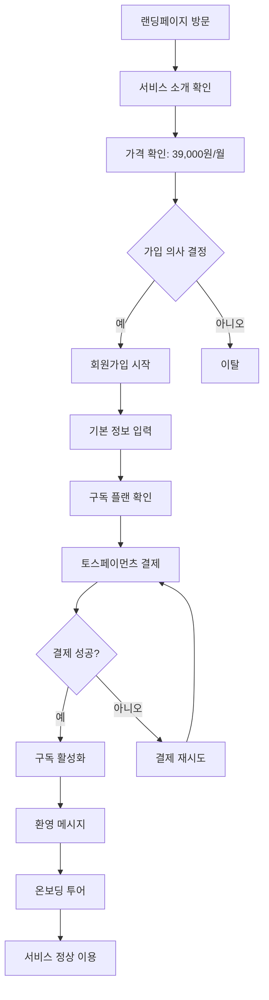
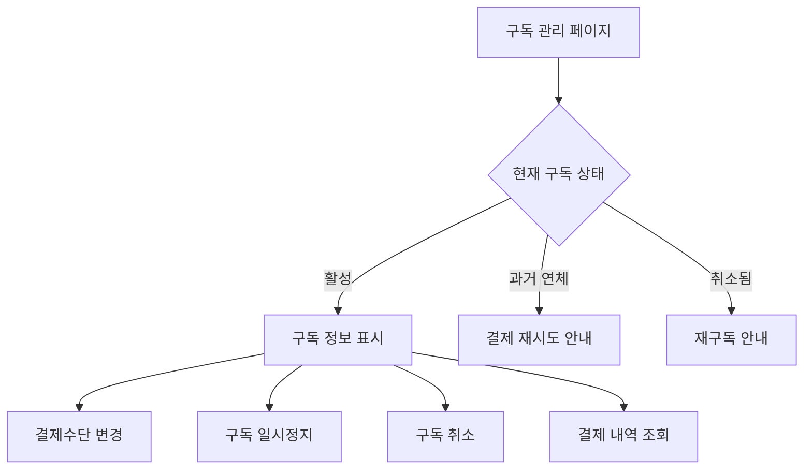
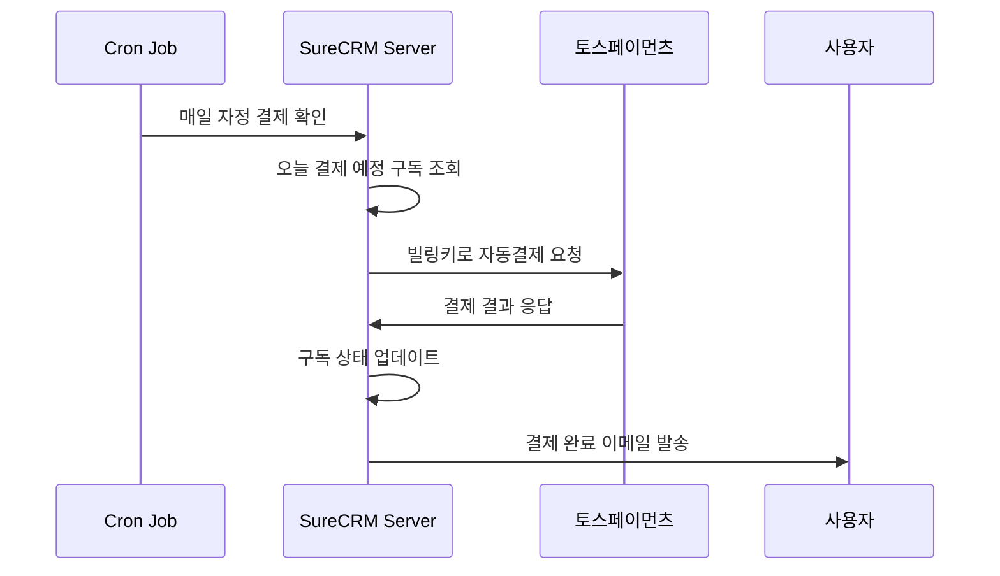

# 📋 SureCRM 토스페이먼츠 구독 결제 시스템 설계서

## 📚 문서 구성

이 설계서는 다음과 같이 구성되어 있습니다:

1. **[메인 설계서](./billing-system-design.md)** (현재 문서)
2. **[기술 구현 가이드](./billing-implementation-guide.md)**
3. **[토스페이먼츠 연동 가이드](./toss-payments-integration.md)**
4. **[예외 처리 가이드](./billing-error-handling.md)**
5. **[데이터베이스 스키마](./billing-database-schema.md)**

---

## 🎯 **1. 프로젝트 개요**

### **1.1 목표**

SureCRM에 토스페이먼츠를 활용한 월 구독 결제 시스템을 통합하여, 안정적이고 확장 가능한 SaaS 수익 모델을 구축한다.

### **1.2 핵심 전략**

- **MVP 접근법**: 단일 플랜으로 시작하여 복잡성 최소화
- **즉시 유료화**: 무료체험 없이 바로 유료 서비스
- **기존 구조 활용**: 현재 feature-driven 아키텍처에 자연스럽게 통합
- **점진적 구현**: 기존 서비스에 영향 없이 단계별 구축

### **1.3 성공 지표**

- 결제 성공률: 95% 이상
- 월 이탈률: 5% 이하
- 결제 관련 고객 문의: 전체 문의의 10% 이하
- 시스템 안정성: 99.9% 업타임

---

## 💰 **2. 구독 모델 정의**

### **2.1 MVP 플랜 스펙**

```typescript
const SURECRM_PLAN = {
  id: 'surecrm-pro',
  name: 'SureCRM Pro',
  price: 39000,
  currency: 'KRW',
  billing_cycle: 'monthly',
  description: '보험설계사를 위한 올인원 CRM 솔루션',

  features: [
    '무제한 고객 관리',
    '영업 파이프라인',
    '키맨 고객 관리',
    '실시간 대시보드',
    '보고서 및 분석',
    '팀 협업 기능',
    '데이터 백업',
    '이메일 지원',
  ],

  limitations: {
    clients: -1, // 무제한
    users: -1, // 무제한
    storage: -1, // 무제한
    api_calls: -1, // 무제한
  },
};
```

### **2.2 가격 정책**

- **기본 요금**: 월 39,000원 (VAT 포함)
- **결제 방식**: 매월 자동결제 (신용카드/체크카드)
- **환불 정책**: 30일 무조건 환불 보장
- **할인 정책**: MVP 단계에서는 없음

### **2.3 경쟁 분석**

- **기존 CRM 솔루션**: 월 5만원~15만원 (기능 제한 많음)
- **SureCRM 차별점**: 보험업계 특화 + 올인원 + 합리적 가격

---

## 🏗️ **3. 시스템 아키텍처**

### **3.1 현재 SureCRM 기술 스택**

- **Frontend**: React Router v7 + TypeScript + Tailwind CSS + Shadcn UI
- **Backend**: React Router SSR (loader/action functions)
- **Database**: Supabase (PostgreSQL) + Drizzle ORM
- **Deployment**: Vercel
- **Authentication**: Supabase Auth

### **3.2 추가될 기술 스택**

- **Payment Gateway**: 토스페이먼츠
- **Billing Management**: 자체 구현
- **Webhook Processing**: Vercel Edge Functions
- **Cron Jobs**: Vercel Cron
- **Email Service**: 기존 시스템 활용

### **3.3 통합 아키텍처**

```
┌─────────────────┐    ┌─────────────────┐    ┌─────────────────┐
│   React Router  │    │   Supabase DB   │    │ 토스페이먼츠    │
│   (Frontend)    │◄──►│   (Storage)     │    │ (Payment)       │
└─────────────────┘    └─────────────────┘    └─────────────────┘
         │                       │                       │
         ▼                       ▼                       ▼
┌─────────────────┐    ┌─────────────────┐    ┌─────────────────┐
│  Billing Module │    │ Subscription    │    │   Webhook       │
│  (features/)    │    │ Management      │    │  Processing     │
└─────────────────┘    └─────────────────┘    └─────────────────┘
```

---

## 🚀 **4. 사용자 여정 설계**

### **4.1 신규 사용자 가입 플로우**



### **4.2 기존 사용자 구독 관리 플로우**



### **4.3 자동결제 플로우**



---

## 🎨 **5. UI/UX 설계**

### **5.1 핵심 페이지 구성**

```
/billing/                     # 구독 관리 홈
├── plans                     # 플랜 선택 (현재는 단일 플랜)
├── setup                     # 결제수단 설정
├── success                   # 결제 성공
├── failed                    # 결제 실패
├── subscription              # 구독 상태 관리
├── history                   # 결제 내역
└── cancel                    # 구독 취소
```

### **5.2 컴포넌트 설계**

```typescript
// 주요 UI 컴포넌트
interface BillingComponents {
  // 플랜 관련
  PlanCard: '단일 플랜 카드 표시';
  PlanFeatures: '기능 목록 표시';

  // 결제 관련
  TossPaymentForm: '토스페이먼츠 결제 폼';
  PaymentMethodCard: '등록된 결제수단 표시';

  // 구독 관리
  SubscriptionStatus: '현재 구독 상태';
  BillingHistory: '결제 내역 테이블';
  UsageProgress: '사용량 진행률 (향후)';

  // 상태 표시
  PaymentStatusBadge: '결제 상태 배지';
  SubscriptionAlert: '구독 관련 알림';
}
```

### **5.3 기존 UI와의 통합**

```typescript
// 기존 설정 페이지에 구독 메뉴 추가
const SettingsNavigation = [
  { name: '프로필', href: '/settings' },
  { name: '팀 관리', href: '/settings/team' },
  { name: '구독 & 결제', href: '/billing' }, // 🆕 추가
  { name: '알림 설정', href: '/settings/notifications' },
];

// 기존 대시보드에 구독 상태 위젯 추가 (선택적)
const DashboardWidgets = [
  // ... 기존 위젯들
  <SubscriptionOverviewWidget />, // 🆕 추가 (선택적)
];
```

---

## 📊 **6. 수익 모델 및 예상 성과**

### **6.1 목표 수익**

```typescript
const RevenueProjection = {
  monthly_price: 39000,
  target_users: {
    '3개월': 30, // 월 117만원
    '6개월': 100, // 월 390만원
    '12개월': 300, // 월 1,170만원
  },

  costs: {
    toss_fee: '2.6% + VAT',
    monthly_cost_per_100_users: 100000, // 약 10만원
    net_margin: '97.4%',
  },
};
```

### **6.2 성공 지표 (KPI)**

```typescript
const KPIs = {
  conversion: {
    landing_to_signup: '목표 3%',
    signup_to_payment: '목표 80%', // 무료체험 없어서 높음
    payment_success_rate: '목표 95%',
  },

  retention: {
    monthly_churn: '목표 5% 이하',
    payment_failure_recovery: '목표 70%',
    customer_lifetime: '목표 12개월+',
  },

  satisfaction: {
    nps_score: '목표 50+',
    support_satisfaction: '목표 4.5/5',
    payment_complaints: '목표 전체 문의의 10% 이하',
  },
};
```

---

## 🔄 **7. 구현 단계별 로드맵**

### **7.1 Phase 1: 기반 구축 (1주)**

**목표**: 독립적인 billing 모듈 생성 및 기본 구조 구축

```bash
# 새로 생성할 파일들
app/features/billing/                # 🆕 전체 모듈
app/lib/schema/billing.ts            # 🆕 데이터베이스 스키마
app/lib/payments/                    # 🆕 결제 로직
docs/billing-*.md                    # 🆕 문서화
```

**체크리스트**:

- [ ] 토스페이먼츠 개발자 계정 생성
- [ ] 테스트키 발급 및 환경 설정
- [ ] billing 모듈 폴더 구조 생성
- [ ] 기본 데이터베이스 스키마 설계
- [ ] 라우팅 구조 설정

### **7.2 Phase 2: 핵심 기능 구현 (2주)**

**목표**: 회원가입+결제 통합 플로우 완성

**Week 1**: UI 및 기본 플로우

- [ ] 회원가입 + 결제 통합 UI
- [ ] 토스페이먼츠 SDK 연동
- [ ] 기본 결제 플로우 구현
- [ ] 성공/실패 페이지 구현

**Week 2**: 자동결제 및 관리

- [ ] 빌링키 발급 및 저장
- [ ] 자동결제 시스템 구현
- [ ] 구독 관리 UI
- [ ] 웹훅 처리 구현

### **7.3 Phase 3: 고급 기능 및 안정화 (1주)**

**목표**: 예외 처리 및 사용자 경험 완성

- [ ] 모든 예외 상황 처리
- [ ] 결제 실패 복구 시스템
- [ ] 이메일 알림 시스템
- [ ] 고객지원 도구
- [ ] 전체 시스템 테스트

### **7.4 Phase 4: 기존 시스템 통합 (1주)**

**목표**: 기존 SureCRM 기능과 자연스럽게 통합

- [ ] 설정 페이지에 구독 메뉴 추가
- [ ] 대시보드에 구독 상태 표시 (선택적)
- [ ] 사용량 제한 시스템 (향후 확장용)
- [ ] 전체 UX 통일성 확인

---

## 🔧 **8. 기술 구현 세부 사항**

### **8.1 폴더 구조**

```
app/
├── features/billing/               # 🆕 구독 결제 모듈
│   ├── components/
│   │   ├── plan-selection/        # 플랜 선택 (현재 단일 플랜)
│   │   ├── payment/               # 결제 관련
│   │   ├── subscription/          # 구독 관리
│   │   └── shared/                # 공통 컴포넌트
│   ├── hooks/
│   │   ├── useSubscription.ts     # 구독 상태 관리
│   │   ├── usePayment.ts          # 결제 처리
│   │   └── useBillingHistory.ts   # 결제 내역
│   ├── lib/
│   │   ├── api/                   # API 함수들
│   │   ├── services/              # 비즈니스 로직
│   │   └── utils/                 # 유틸리티
│   ├── pages/
│   │   ├── billing-page.tsx       # /billing
│   │   ├── plans-page.tsx         # /billing/plans
│   │   ├── setup-page.tsx         # /billing/setup
│   │   ├── success-page.tsx       # /billing/success
│   │   ├── failed-page.tsx        # /billing/failed
│   │   └── subscription-page.tsx  # /billing/subscription
│   └── types/
│       ├── billing.types.ts       # 타입 정의
│       └── payment.types.ts       # 결제 타입
│
├── lib/
│   ├── payments/                  # 🆕 결제 시스템 코어
│   │   ├── toss-payments/         # 토스페이먼츠 연동
│   │   ├── billing/               # 빌링 로직
│   │   └── webhooks/              # 웹훅 처리
│   └── schema/
│       └── billing.ts             # 🆕 결제 관련 스키마
│
└── routes/
    ├── api.billing.*.ts           # 🆕 결제 관련 API
    └── api.webhooks.toss.ts       # 🆕 토스페이먼츠 웹훅
```

### **8.2 환경 변수 설정**

```bash
# .env.local
# 토스페이먼츠 설정
TOSS_CLIENT_KEY=test_ck_...         # 테스트 클라이언트 키
TOSS_SECRET_KEY=test_sk_...         # 테스트 시크릿 키
TOSS_WEBHOOK_SECRET=...             # 웹훅 검증용 시크릿

# 결제 설정
PAYMENT_MODE=test                   # test | production
BILLING_ENCRYPTION_KEY=...         # 빌링키 암호화용

# 서비스 설정
SERVICE_URL=http://localhost:3000   # 콜백 URL용
CUSTOMER_SUPPORT_EMAIL=...          # 고객지원 이메일
```

---

## 🎯 **9. 다음 단계**

### **9.1 즉시 해야 할 일**

1. **토스페이먼츠 개발자 계정 생성** 📋 [상세 가이드](./toss-payments-integration.md)
2. **프로젝트 환경 설정**
3. **첫 번째 테스트 결제 구현**

### **9.2 관련 문서**

- **[기술 구현 가이드](./billing-implementation-guide.md)**: 코드 구현 세부사항
- **[토스페이먼츠 연동 가이드](./toss-payments-integration.md)**: 토스페이먼츠 연동 단계별 가이드
- **[예외 처리 가이드](./billing-error-handling.md)**: 모든 예외 상황 대응 방안
- **[데이터베이스 스키마](./billing-database-schema.md)**: 테이블 설계 및 관계

---

## 📞 **10. 지원 및 문의**

구현 중 문제가 발생하거나 추가 설명이 필요한 경우:

1. **토스페이먼츠 관련**: [토스페이먼츠 연동 가이드](./toss-payments-integration.md) 참조
2. **기술 구현 관련**: [기술 구현 가이드](./billing-implementation-guide.md) 참조
3. **예외 처리 관련**: [예외 처리 가이드](./billing-error-handling.md) 참조

---

**📝 마지막 업데이트**: 2024-01-15
**📋 문서 버전**: v1.0
**👨‍💻 작성자**: AI Assistant + 개발팀
