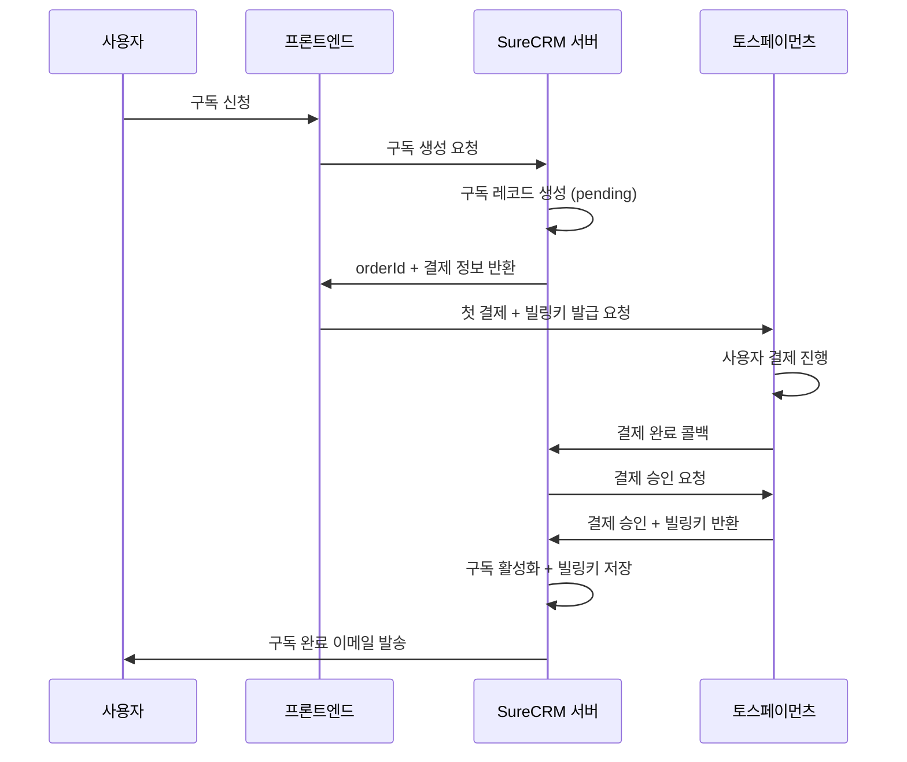

# 🏦 토스페이먼츠 연동 완전 가이드

## 📚 목차

1. [토스페이먼츠 계정 설정](#1-토스페이먼츠-계정-설정)
2. [개발 환경 구축](#2-개발-환경-구축)
3. [SDK 설치 및 초기 설정](#3-sdk-설치-및-초기-설정)
4. [구독 결제 구현](#4-구독-결제-구현)
5. [웹훅 처리](#5-웹훅-처리)
6. [테스트 시나리오](#6-테스트-시나리오)
7. [운영 전환 가이드](#7-운영-전환-가이드)

---

## 🎯 **1. 토스페이먼츠 계정 설정**

### **1.1 개발자 계정 생성**

**⚠️ 중요**: 토스페이먼츠는 구독 결제를 위해 **별도 계약**이 필요합니다!

#### **Step 1: 토스페이먼츠 개발자센터 가입**

```bash
# 1. 토스페이먼츠 개발자센터 접속
https://developers.tosspayments.com/

# 2. 회원가입 (개인 또는 사업자)
- 이메일 인증
- 기본 정보 입력
- 개발자 약관 동의
```

#### **Step 2: 테스트 애플리케이션 생성**

```typescript
// 애플리케이션 정보 입력
const AppConfig = {
  name: 'SureCRM',
  description: '보험설계사 CRM 솔루션',
  category: 'SaaS/CRM',
  website: 'https://your-domain.com',

  // 콜백 URL (나중에 설정)
  success_url: 'https://your-domain.com/billing/success',
  fail_url: 'https://your-domain.com/billing/failed',
};
```

#### **Step 3: 구독 결제 신청**

```markdown
⚠️ **중요**: 토스페이먼츠 구독 결제는 별도 신청이 필요합니다!

1. 개발자센터 → "서비스 신청" → "정기결제/자동결제"
2. 사업 계획서 제출:

   - 서비스 개요: SureCRM 보험설계사 CRM
   - 예상 월 결제 건수: 100~500건
   - 평균 결제 금액: 39,000원
   - 결제 주기: 매월

3. 심사 기간: 1~3 영업일
4. 승인 후 구독 결제 API 사용 가능
```

### **1.2 API 키 발급**

```typescript
// 개발자센터에서 발급받는 키들
const ApiKeys = {
  // 테스트 환경 (개발용)
  test: {
    clientKey: 'test_ck_D5GePWvyJnrK0W0k6q8gLzN97Eoq', // 공개키
    secretKey: 'test_sk_zXLkKEypNArWmo50nX3lmeaxYG5R', // 비밀키 (서버 전용)
  },

  // 운영 환경 (나중에 발급)
  production: {
    clientKey: 'live_ck_...',
    secretKey: 'live_sk_...', // ⚠️ 절대 노출 금지
  },
};
```

---

## 🔧 **2. 개발 환경 구축**

### **2.1 프로젝트 환경 변수 설정**

```bash
# .env.local
# 토스페이먼츠 설정
TOSS_CLIENT_KEY=test_ck_D5GePWvyJnrK0W0k6q8gLzN97Eoq
TOSS_SECRET_KEY=test_sk_zXLkKEypNArWmo50nX3lmeaxYG5R
TOSS_WEBHOOK_SECRET=your_webhook_secret_here

# 결제 환경
PAYMENT_MODE=test
TOSS_BASE_URL=https://api.tosspayments.com

# 서비스 URL
NEXT_PUBLIC_SERVICE_URL=http://localhost:3000
SERVICE_URL=http://localhost:3000

# 구독 설정
SUBSCRIPTION_PLAN_ID=surecrm-pro
SUBSCRIPTION_PRICE=39000
SUBSCRIPTION_CURRENCY=KRW
```

### **2.2 환경 변수 타입 정의**

```typescript
// app/lib/env.ts
interface EnvConfig {
  toss: {
    clientKey: string;
    secretKey: string;
    webhookSecret: string;
    baseUrl: string;
  };
  payment: {
    mode: 'test' | 'production';
  };
  service: {
    url: string;
    publicUrl: string;
  };
  subscription: {
    planId: string;
    price: number;
    currency: string;
  };
}

export const env: EnvConfig = {
  toss: {
    clientKey: process.env.TOSS_CLIENT_KEY!,
    secretKey: process.env.TOSS_SECRET_KEY!,
    webhookSecret: process.env.TOSS_WEBHOOK_SECRET!,
    baseUrl: process.env.TOSS_BASE_URL || 'https://api.tosspayments.com',
  },
  payment: {
    mode: (process.env.PAYMENT_MODE as 'test' | 'production') || 'test',
  },
  service: {
    url: process.env.SERVICE_URL!,
    publicUrl: process.env.NEXT_PUBLIC_SERVICE_URL!,
  },
  subscription: {
    planId: process.env.SUBSCRIPTION_PLAN_ID || 'surecrm-pro',
    price: Number(process.env.SUBSCRIPTION_PRICE) || 39000,
    currency: process.env.SUBSCRIPTION_CURRENCY || 'KRW',
  },
};
```

---

## 📦 **3. SDK 설치 및 초기 설정**

### **3.1 패키지 설치**

```bash
# 토스페이먼츠 SDK 설치
npm install @tosspayments/payment-sdk

# 타입 정의 (TypeScript)
npm install -D @types/toss-payments

# 추가 유틸리티
npm install crypto-js                # 암호화용
npm install date-fns                 # 날짜 처리용
```

### **3.2 토스페이먼츠 클라이언트 설정**

```typescript
// app/lib/payments/toss-client.ts
import { TossPayments } from '@tosspayments/payment-sdk';
import { env } from '~/lib/env';

export class TossPaymentsClient {
  private client: TossPayments;

  constructor() {
    this.client = TossPayments(env.toss.clientKey);
  }

  // 일반 결제 (첫 구독 결제용)
  async requestPayment(params: PaymentRequest) {
    return await this.client.requestPayment('카드', {
      amount: params.amount,
      orderId: params.orderId,
      orderName: params.orderName,
      customerName: params.customerName,
      customerEmail: params.customerEmail,
      successUrl: `${env.service.publicUrl}/api/billing/payment/success`,
      failUrl: `${env.service.publicUrl}/api/billing/payment/failed`,
    });
  }

  // 빌링키 발급 (구독용)
  async requestBillingKey(params: BillingKeyRequest) {
    return await this.client.requestBillingAuth('카드', {
      customerKey: params.customerKey,
      successUrl: `${env.service.publicUrl}/api/billing/auth/success`,
      failUrl: `${env.service.publicUrl}/api/billing/auth/failed`,
    });
  }
}

// 타입 정의
interface PaymentRequest {
  amount: number;
  orderId: string;
  orderName: string;
  customerName: string;
  customerEmail: string;
}

interface BillingKeyRequest {
  customerKey: string;
}

export const tossClient = new TossPaymentsClient();
```

### **3.3 서버사이드 API 클라이언트**

```typescript
// app/lib/payments/toss-api.ts
import { env } from '~/lib/env';

export class TossPaymentsAPI {
  private baseUrl = env.toss.baseUrl;
  private secretKey = env.toss.secretKey;

  private getHeaders() {
    const auth = Buffer.from(`${this.secretKey}:`).toString('base64');
    return {
      Authorization: `Basic ${auth}`,
      'Content-Type': 'application/json',
    };
  }

  // 결제 승인
  async confirmPayment(paymentKey: string, orderId: string, amount: number) {
    const response = await fetch(`${this.baseUrl}/v1/payments/confirm`, {
      method: 'POST',
      headers: this.getHeaders(),
      body: JSON.stringify({
        paymentKey,
        orderId,
        amount,
      }),
    });

    if (!response.ok) {
      throw new Error(`결제 승인 실패: ${response.status}`);
    }

    return response.json();
  }

  // 빌링키로 자동결제
  async payWithBillingKey(params: BillingPaymentParams) {
    const response = await fetch(
      `${this.baseUrl}/v1/billing/${params.billingKey}`,
      {
        method: 'POST',
        headers: this.getHeaders(),
        body: JSON.stringify({
          customerKey: params.customerKey,
          amount: params.amount,
          orderId: params.orderId,
          orderName: params.orderName,
          customerEmail: params.customerEmail,
        }),
      }
    );

    if (!response.ok) {
      const error = await response.json();
      throw new Error(`자동결제 실패: ${error.message}`);
    }

    return response.json();
  }

  // 빌링키 조회
  async getBillingKey(billingKey: string) {
    const response = await fetch(
      `${this.baseUrl}/v1/billing/authorizations/${billingKey}`,
      {
        method: 'GET',
        headers: this.getHeaders(),
      }
    );

    return response.json();
  }
}

interface BillingPaymentParams {
  billingKey: string;
  customerKey: string;
  amount: number;
  orderId: string;
  orderName: string;
  customerEmail: string;
}

export const tossAPI = new TossPaymentsAPI();
```

---

## 💳 **4. 구독 결제 구현**

### **4.1 구독 결제 플로우**



### **4.2 첫 결제 + 빌링키 발급 구현**

```typescript
// app/features/billing/lib/subscription-service.ts
export class SubscriptionService {
  async createSubscription(userId: string, planId: string) {
    // 1. 구독 레코드 생성
    const subscription = await this.createPendingSubscription(userId, planId);

    // 2. 주문 ID 생성
    const orderId = `sub_${subscription.id}_${Date.now()}`;

    // 3. 고객 키 생성 (빌링키용)
    const customerKey = `customer_${userId}`;

    // 4. 결제 요청 데이터 구성
    const paymentData = {
      amount: 39000,
      orderId,
      orderName: 'SureCRM Pro 구독',
      customerKey,
      successUrl: `${env.service.publicUrl}/billing/setup/success`,
      failUrl: `${env.service.publicUrl}/billing/setup/failed`,
    };

    return {
      subscription,
      paymentData,
    };
  }

  private async createPendingSubscription(userId: string, planId: string) {
    return await db
      .insert(userSubscriptions)
      .values({
        id: crypto.randomUUID(),
        userId,
        planId,
        status: 'pending_payment',
        currentPeriodStart: new Date(),
        currentPeriodEnd: addMonths(new Date(), 1),
        createdAt: new Date(),
      })
      .returning();
  }
}
```

### **4.3 프론트엔드 결제 컴포넌트**

```typescript
// app/features/billing/components/payment/SubscriptionPaymentForm.tsx
import { tossClient } from '~/lib/payments/toss-client';

interface SubscriptionPaymentFormProps {
  subscription: Subscription;
  paymentData: PaymentData;
}

export function SubscriptionPaymentForm({
  subscription,
  paymentData,
}: SubscriptionPaymentFormProps) {
  const [isProcessing, setIsProcessing] = useState(false);

  const handlePayment = async () => {
    setIsProcessing(true);

    try {
      // 토스페이먼츠 결제 요청
      await tossClient.requestBillingAuth('카드', {
        customerKey: paymentData.customerKey,
        successUrl: paymentData.successUrl,
        failUrl: paymentData.failUrl,
      });
    } catch (error) {
      console.error('결제 요청 실패:', error);
      // 에러 처리
    } finally {
      setIsProcessing(false);
    }
  };

  return (
    <div className="space-y-6">
      {/* 구독 정보 표시 */}
      <div className="border rounded-lg p-4">
        <h3 className="text-lg font-semibold">SureCRM Pro</h3>
        <p className="text-gray-600">월 39,000원</p>
        <ul className="mt-2 space-y-1 text-sm">
          <li>✅ 무제한 고객 관리</li>
          <li>✅ 영업 파이프라인</li>
          <li>✅ 실시간 대시보드</li>
          {/* 더 많은 기능들... */}
        </ul>
      </div>

      {/* 결제 버튼 */}
      <Button
        onClick={handlePayment}
        disabled={isProcessing}
        className="w-full"
        size="lg"
      >
        {isProcessing ? '처리 중...' : '구독 시작하기'}
      </Button>

      {/* 안내 문구 */}
      <p className="text-xs text-gray-500 text-center">
        구독 시작 시 즉시 요금이 청구되며, 매월 자동으로 갱신됩니다.
        <br />
        30일 내 언제든 취소 가능합니다.
      </p>
    </div>
  );
}
```

### **4.4 결제 성공 처리**

```typescript
// app/routes/api.billing.payment.success.ts
import type { Route } from './+types/api.billing.payment.success';
import { tossAPI } from '~/lib/payments/toss-api';
import { SubscriptionService } from '~/features/billing/lib/subscription-service';

export async function loader({ request }: Route.LoaderArgs) {
  const url = new URL(request.url);
  const paymentKey = url.searchParams.get('paymentKey');
  const orderId = url.searchParams.get('orderId');
  const amount = url.searchParams.get('amount');

  if (!paymentKey || !orderId || !amount) {
    throw new Response('필수 파라미터 누락', { status: 400 });
  }

  try {
    // 1. 토스페이먼츠 결제 승인
    const payment = await tossAPI.confirmPayment(
      paymentKey,
      orderId,
      Number(amount)
    );

    // 2. 빌링키 저장 및 구독 활성화
    const subscriptionService = new SubscriptionService();
    await subscriptionService.confirmSubscription(orderId, payment);

    // 3. 성공 페이지로 리다이렉트
    return redirect('/billing/success');
  } catch (error) {
    console.error('결제 승인 실패:', error);
    return redirect('/billing/failed?error=payment_confirmation_failed');
  }
}
```

---

## 🔄 **5. 웹훅 처리**

### **5.1 웹훅 엔드포인트 구현**

```typescript
// app/routes/api.webhooks.toss.ts
import type { Route } from './+types/api.webhooks.toss';
import { env } from '~/lib/env';
import crypto from 'crypto';

export async function action({ request }: Route.ActionArgs) {
  // 1. 웹훅 서명 검증
  const signature = request.headers.get('x-toss-signature');
  const rawBody = await request.text();

  if (!verifyWebhookSignature(rawBody, signature)) {
    return new Response('Unauthorized', { status: 401 });
  }

  // 2. 웹훅 데이터 파싱
  const webhookData = JSON.parse(rawBody);

  try {
    await processWebhook(webhookData);
    return new Response('OK', { status: 200 });
  } catch (error) {
    console.error('웹훅 처리 실패:', error);
    return new Response('Internal Server Error', { status: 500 });
  }
}

function verifyWebhookSignature(
  body: string,
  signature: string | null
): boolean {
  if (!signature) return false;

  const hash = crypto
    .createHmac('sha256', env.toss.webhookSecret)
    .update(body)
    .digest('base64');

  return hash === signature;
}

async function processWebhook(data: any) {
  switch (data.eventType) {
    case 'PAYMENT_STATUS_CHANGED':
      await handlePaymentStatusChanged(data);
      break;

    case 'BILLING_KEY_PAYMENT_STATUS_CHANGED':
      await handleBillingPaymentStatusChanged(data);
      break;

    default:
      console.log('처리되지 않은 웹훅 타입:', data.eventType);
  }
}
```

### **5.2 자동결제 실패 처리**

```typescript
// app/lib/payments/billing/auto-payment.ts
export class AutoPaymentService {
  async processFailedPayment(subscriptionId: string, error: PaymentError) {
    const subscription = await this.getSubscription(subscriptionId);

    // 재시도 횟수 증가
    const retryCount = subscription.retryCount + 1;

    if (retryCount <= 3) {
      // 재시도 스케줄링 (3일, 7일, 14일 후)
      const retryDate = this.calculateRetryDate(retryCount);

      await this.updateSubscription(subscriptionId, {
        status: 'past_due',
        retryCount,
        nextRetryDate: retryDate,
      });

      // 고객에게 결제 실패 알림
      await this.sendPaymentFailureNotification(subscription);
    } else {
      // 최대 재시도 초과 시 구독 일시정지
      await this.suspendSubscription(subscriptionId);
      await this.sendSubscriptionSuspendedNotification(subscription);
    }
  }

  private calculateRetryDate(retryCount: number): Date {
    const days = retryCount === 1 ? 3 : retryCount === 2 ? 7 : 14;
    return addDays(new Date(), days);
  }
}
```

---

## 🧪 **6. 테스트 시나리오**

### **6.1 테스트 카드 정보**

```typescript
// 토스페이먼츠 테스트 카드
const TestCards = {
  success: {
    number: '4000000000000002',
    expiry: '12/30',
    cvc: '123',
    description: '결제 성공 테스트용',
  },

  failure: {
    number: '4000000000000010',
    expiry: '12/30',
    cvc: '123',
    description: '결제 실패 테스트용',
  },

  auth_failure: {
    number: '4000000000000028',
    expiry: '12/30',
    cvc: '123',
    description: '본인인증 실패 테스트용',
  },
};
```

### **6.2 테스트 케이스**

```typescript
// 테스트 시나리오
const TestScenarios = [
  {
    name: '정상 구독 생성',
    steps: [
      '1. 회원가입 완료',
      '2. 구독 플랜 선택',
      '3. 테스트 카드로 결제',
      '4. 빌링키 발급 확인',
      '5. 구독 활성화 확인',
      '6. 이메일 알림 수신 확인',
    ],
    expected: '구독 상태: active, 빌링키 저장됨',
  },

  {
    name: '결제 실패 처리',
    steps: [
      '1. 실패용 테스트 카드 사용',
      '2. 결제 실패 확인',
      '3. 실패 페이지 표시 확인',
      '4. 재시도 버튼 동작 확인',
    ],
    expected: '구독 상태: pending_payment, 재시도 가능',
  },

  {
    name: '자동결제 성공',
    steps: [
      '1. 기존 구독자의 결제일 도래',
      '2. 크론잡 실행',
      '3. 빌링키로 자동결제',
      '4. 결제 완료 이메일 발송',
    ],
    expected: '다음 결제일 연장, 서비스 계속 이용',
  },

  {
    name: '자동결제 실패 및 재시도',
    steps: [
      '1. 잔액 부족으로 자동결제 실패',
      '2. 재시도 스케줄링',
      '3. 고객 알림 발송',
      '4. 3일 후 재시도',
      '5. 재시도 성공 또는 실패',
    ],
    expected: '적절한 상태 변경 및 알림',
  },
];
```

---

## 🚀 **7. 운영 전환 가이드**

### **7.1 사업자등록 및 심사**

```markdown
# 토스페이먼츠 실서비스 전환 체크리스트

## 📋 사전 준비사항

- [ ] 사업자등록증 (개인사업자 또는 법인)
- [ ] 통장 사본 (정산 계좌)
- [ ] 서비스 소개서
- [ ] 개인정보처리방침
- [ ] 이용약관

## 📝 신청 과정

1. 개발자센터에서 "실서비스 신청"
2. 사업자 정보 입력
3. 서비스 심사 (3~5 영업일)
4. 계약서 작성 및 서명
5. 실서비스 키 발급

## 💰 수수료 및 정산

- 신용카드: 2.6% + VAT
- 정산 주기: T+2 (2 영업일 후)
- 최소 정산 금액: 1만원
```

### **7.2 운영 환경 전환**

```typescript
// 운영 환경 변수로 교체
const ProductionEnv = {
  TOSS_CLIENT_KEY: 'live_ck_...', // 실서비스 클라이언트 키
  TOSS_SECRET_KEY: 'live_sk_...', // 실서비스 시크릿 키
  PAYMENT_MODE: 'production',
  TOSS_BASE_URL: 'https://api.tosspayments.com',

  // 실제 서비스 URL
  SERVICE_URL: 'https://surecrm.com',
  NEXT_PUBLIC_SERVICE_URL: 'https://surecrm.com',
};
```

### **7.3 모니터링 설정**

```typescript
// 운영 모니터링
const ProductionMonitoring = {
  alerts: [
    '결제 성공률 90% 미만',
    '웹훅 처리 실패 5건 이상',
    '구독 취소율 20% 이상',
  ],

  dashboards: [
    '일별 결제 현황',
    '월별 매출 통계',
    '고객 이탈률',
    '결제 실패율',
  ],

  logs: ['모든 결제 트랜잭션', '웹훅 처리 내역', '에러 및 예외 상황'],
};
```

---

## 📞 **8. 고객지원 및 문제 해결**

### **8.1 자주 발생하는 문제**

```typescript
const CommonIssues = {
  '결제창이 안 열려요': {
    cause: 'CORS 문제 또는 도메인 설정',
    solution: '개발자센터에서 허용 도메인 추가',
  },

  '빌링키 발급 실패': {
    cause: '구독 결제 미승인 상태',
    solution: '토스페이먼츠에 구독 결제 신청',
  },

  '웹훅이 안 와요': {
    cause: 'URL 오타 또는 서버 응답 문제',
    solution: '웹훅 URL 확인 및 200 응답 보장',
  },
};
```

### **8.2 고객센터 연락처**

```markdown
# 토스페이먼츠 지원

## 🎧 고객지원

- 전화: 1588-7711
- 이메일: developers@tosspayments.com
- 운영시간: 평일 09:00~18:00

## 📚 개발자 리소스

- 개발자센터: https://developers.tosspayments.com
- API 문서: https://docs.tosspayments.com
- 샘플 코드: https://github.com/tosspayments
- 커뮤니티: https://community.tosspayments.com
```

---

**📝 마지막 업데이트**: 2024-01-15  
**📋 문서 버전**: v1.0  
**👨‍💻 작성자**: AI Assistant + 개발팀
